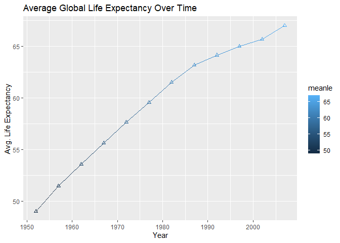
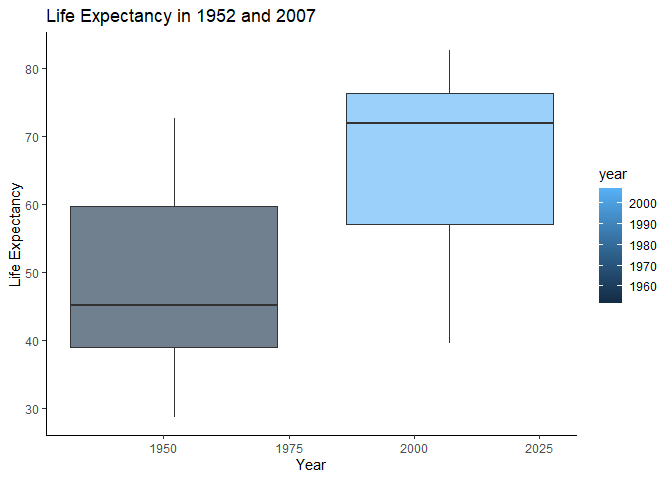
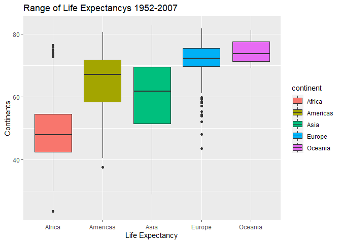
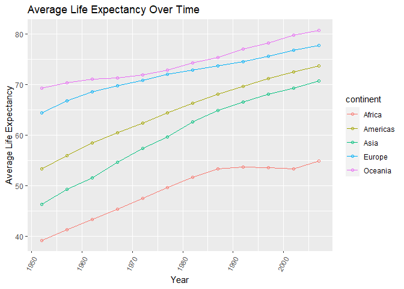
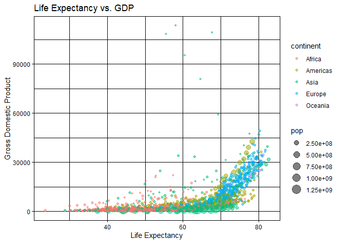
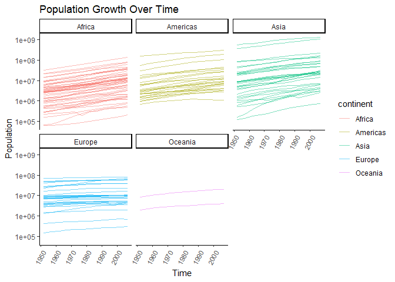
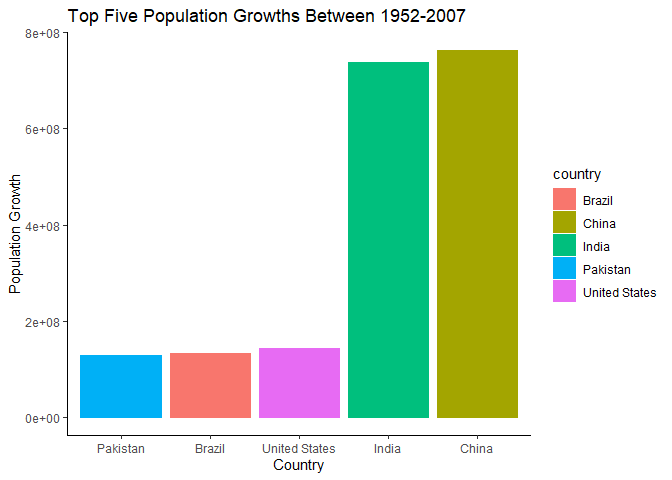
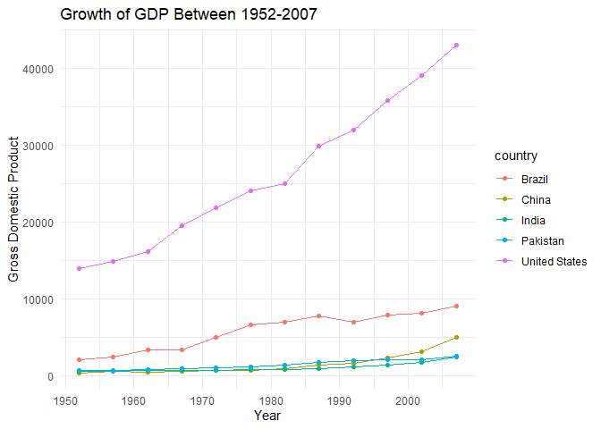
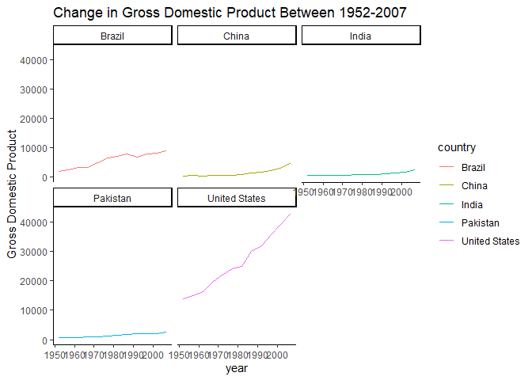

## Instructions
Answer the following questions and complete the exercises in RMarkdown. Please embed all of your code and push your final work to your repository. Your final lab report should be organized, clean, and run free from errors. Remember, you must remove the `#` for the included code chunks to run. Be sure to add your name to the author header above. For any included plots, make sure they are clearly labeled. You are free to use any plot type that you feel best communicates the results of your analysis.  

**In this homework, you should make use of the aesthetics you have learned. It's OK to be flashy!**

Make sure to use the formatting conventions of RMarkdown to make your report neat and clean!  

## Load the libraries

```r
library(tidyverse)
library(janitor)
library(here)
library(naniar)
```

## Resources
The idea for this assignment came from [Rebecca Barter's](http://www.rebeccabarter.com/blog/2017-11-17-ggplot2_tutorial/) ggplot tutorial so if you get stuck this is a good place to have a look.  

## Gapminder
For this assignment, we are going to use the dataset [gapminder](https://cran.r-project.org/web/packages/gapminder/index.html). Gapminder includes information about economics, population, and life expectancy from countries all over the world. You will need to install it before use. This is the same data that we will use for midterm 2 so this is good practice.

```r
#install.packages("gapminder")
library("gapminder")
```

## Questions
The questions below are open-ended and have many possible solutions. Your approach should, where appropriate, include numerical summaries and visuals. Be creative; assume you are building an analysis that you would ultimately present to an audience of stakeholders. Feel free to try out different `geoms` if they more clearly present your results.  

**1. Use the function(s) of your choice to get an idea of the overall structure of the data frame, including its dimensions, column names, variable classes, etc. As part of this, determine how NA's are treated in the data.**  

```r
glimpse(gapminder)
```

```
## Rows: 1,704
## Columns: 6
## $ country   <fct> Afghanistan, Afghanistan, Afghanistan, Afghanistan, Afghanis~
## $ continent <fct> Asia, Asia, Asia, Asia, Asia, Asia, Asia, Asia, Asia, Asia, ~
## $ year      <int> 1952, 1957, 1962, 1967, 1972, 1977, 1982, 1987, 1992, 1997, ~
## $ lifeExp   <dbl> 28.801, 30.332, 31.997, 34.020, 36.088, 38.438, 39.854, 40.8~
## $ pop       <int> 8425333, 9240934, 10267083, 11537966, 13079460, 14880372, 12~
## $ gdpPercap <dbl> 779.4453, 820.8530, 853.1007, 836.1971, 739.9811, 786.1134, ~
```

```r
any_na(gapminder)
```

```
## [1] FALSE
```

```r
summary(gapminder)
```

```
##         country        continent        year         lifeExp     
##  Afghanistan:  12   Africa  :624   Min.   :1952   Min.   :23.60  
##  Albania    :  12   Americas:300   1st Qu.:1966   1st Qu.:48.20  
##  Algeria    :  12   Asia    :396   Median :1980   Median :60.71  
##  Angola     :  12   Europe  :360   Mean   :1980   Mean   :59.47  
##  Argentina  :  12   Oceania : 24   3rd Qu.:1993   3rd Qu.:70.85  
##  Australia  :  12                  Max.   :2007   Max.   :82.60  
##  (Other)    :1632                                                
##       pop              gdpPercap       
##  Min.   :6.001e+04   Min.   :   241.2  
##  1st Qu.:2.794e+06   1st Qu.:  1202.1  
##  Median :7.024e+06   Median :  3531.8  
##  Mean   :2.960e+07   Mean   :  7215.3  
##  3rd Qu.:1.959e+07   3rd Qu.:  9325.5  
##  Max.   :1.319e+09   Max.   :113523.1  
## 
```

```r
miss_var_summary(gapminder)
```

```
## # A tibble: 6 x 3
##   variable  n_miss pct_miss
##   <chr>      <int>    <dbl>
## 1 country        0        0
## 2 continent      0        0
## 3 year           0        0
## 4 lifeExp        0        0
## 5 pop            0        0
## 6 gdpPercap      0        0
```

**2. Among the interesting variables in gapminder is life expectancy. How has global life expectancy changed between 1952 and 2007?**

```r
gapminder%>%
  group_by(year)%>%
  summarise(meanle=mean(lifeExp,na.rm = T))
```

```
## # A tibble: 12 x 2
##     year meanle
##  * <int>  <dbl>
##  1  1952   49.1
##  2  1957   51.5
##  3  1962   53.6
##  4  1967   55.7
##  5  1972   57.6
##  6  1977   59.6
##  7  1982   61.5
##  8  1987   63.2
##  9  1992   64.2
## 10  1997   65.0
## 11  2002   65.7
## 12  2007   67.0
```

```r
gapminder %>% 
  group_by(year) %>% 
  summarize(meanle=mean(lifeExp,na.rm=T),.groups="keep") %>% 
  ggplot(aes(x=year,y=meanle, color=meanle))+
  geom_line()+
  geom_point(shape=2)+
  theme(axis.text.x = element_text(angle = 0, hjust = .5))+
  labs(title = "Average Global Life Expectancy Over Time",
       x = "Year",
       y = "Avg. Life Expectancy"
  )
```

<!-- -->

**3. How do the distributions of life expectancy compare for the years 1952 and 2007?**

```r
gapminder%>%
  filter(year=="1952"|year=="2007")%>%
  ggplot(aes(x=year,y=lifeExp,group=year,fill=year))+
  geom_boxplot(alpha=.6)+
  labs(title="Life Expectancy in 1952 and 2007",x="Year",y="Life Expectancy")+
         theme_classic()
```

<!-- -->

```r
gapminder %>% 
  filter(year=="1952" | year=="2007") %>% 
  group_by(year) %>% 
  summarize(minLE=min(lifeExp),
            medianLE=median(lifeExp),
            maxLE=max(lifeExp),.groups="keep")
```

```
## # A tibble: 2 x 4
## # Groups:   year [2]
##    year minLE medianLE maxLE
##   <int> <dbl>    <dbl> <dbl>
## 1  1952  28.8     45.1  72.7
## 2  2007  39.6     71.9  82.6
```

**4. Your answer above doesn't tell the whole story since life expectancy varies by region. Make a summary that shows the min, mean, and max life expectancy by continent for all years represented in the data.**

```r
gapminder %>% 
  group_by(continent) %>% 
  summarize(minLE=min(lifeExp),
            meanLE=mean(lifeExp),
            maxLE=max(lifeExp),.groups="keep")
```

```
## # A tibble: 5 x 4
## # Groups:   continent [5]
##   continent minLE meanLE maxLE
##   <fct>     <dbl>  <dbl> <dbl>
## 1 Africa     23.6   48.9  76.4
## 2 Americas   37.6   64.7  80.7
## 3 Asia       28.8   60.1  82.6
## 4 Europe     43.6   71.9  81.8
## 5 Oceania    69.1   74.3  81.2
```

```r
gapminder %>% 
  ggplot(aes(x=continent,y=lifeExp, group=continent,fill=continent))+
  geom_boxplot()+
  labs(title="Range of Life Expectancys 1952-2007",
       x="Life Expectancy",
       y="Continents")
```

<!-- -->

**5. How has life expectancy changed between 1952-2007 for each continent?**

```r
gapminder %>% 
  group_by(year,continent) %>% 
  summarise(avgLE=mean(lifeExp),.groups="keep") %>% 
  ggplot(aes(x=year, y=avgLE, group=continent, color=continent))+
  geom_line()+
  geom_point(shape=1)+
  theme(axis.text.x = element_text(angle = 60, hjust = 1))+
  labs(title = "Average Life Expectancy Over Time",
       x = "Year",
       y = "Average Life Expectancy")
```

<!-- -->

```r
gapminder%>%
  group_by(continent,year)%>%
  summarise(meanle=mean(lifeExp),.groups="keep")
```

```
## # A tibble: 60 x 3
## # Groups:   continent, year [60]
##    continent  year meanle
##    <fct>     <int>  <dbl>
##  1 Africa     1952   39.1
##  2 Africa     1957   41.3
##  3 Africa     1962   43.3
##  4 Africa     1967   45.3
##  5 Africa     1972   47.5
##  6 Africa     1977   49.6
##  7 Africa     1982   51.6
##  8 Africa     1987   53.3
##  9 Africa     1992   53.6
## 10 Africa     1997   53.6
## # ... with 50 more rows
```

```r
names(gapminder)
```

```
## [1] "country"   "continent" "year"      "lifeExp"   "pop"       "gdpPercap"
```

**6. We are interested in the relationship between per capita GDP and life expectancy; i.e. does having more money help you live longer?**

```r
gapminder %>% 
  select(lifeExp,gdpPercap) %>% 
  arrange(lifeExp)
```

```
## # A tibble: 1,704 x 2
##    lifeExp gdpPercap
##      <dbl>     <dbl>
##  1    23.6      737.
##  2    28.8      779.
##  3    30        485.
##  4    30.0     3521.
##  5    30.3      880.
##  6    30.3      821.
##  7    31.2      525.
##  8    31.3      469.
##  9    31.6     1004.
## 10    32.0      543.
## # ... with 1,694 more rows
```

```r
gapminder %>% 
  ggplot(aes(x=lifeExp,y=gdpPercap,color=continent, size=pop))+
  geom_point(alpha=.5)+
  theme_linedraw()+
  theme(axis.text.x = element_text(angle = 0, hjust=.5))+
  labs(title="Life Expectancy vs. GDP",
       x="Life Expectancy",
       y="Gross Domestic Product")
```

<!-- -->
There is a positive correlation between GDP and Life Expectancy (more money=longer life).

**7. Which countries have had the largest population growth since 1952?**

```r
gapminder %>% 
  ggplot(aes(x=year,y=pop,group=country,color=continent))+
  geom_line(alpha=.5)+
  scale_y_log10()+
  labs(title="Population Growth Over Time",
       x="Time",
       y="Population")+
  theme_classic(base_family="Avenir")+
  theme(axis.text.x=element_text(angle=60,hjust=1))+
  facet_wrap(~continent)
```

```
## Warning in grid.Call(C_stringMetric, as.graphicsAnnot(x$label)): font family not
## found in Windows font database

## Warning in grid.Call(C_stringMetric, as.graphicsAnnot(x$label)): font family not
## found in Windows font database
```

```
## Warning in grid.Call(C_textBounds, as.graphicsAnnot(x$label), x$x, x$y, : font
## family not found in Windows font database
```

```
## Warning in grid.Call(C_stringMetric, as.graphicsAnnot(x$label)): font family not
## found in Windows font database
```

```
## Warning in grid.Call(C_textBounds, as.graphicsAnnot(x$label), x$x, x$y, : font
## family not found in Windows font database

## Warning in grid.Call(C_textBounds, as.graphicsAnnot(x$label), x$x, x$y, : font
## family not found in Windows font database

## Warning in grid.Call(C_textBounds, as.graphicsAnnot(x$label), x$x, x$y, : font
## family not found in Windows font database

## Warning in grid.Call(C_textBounds, as.graphicsAnnot(x$label), x$x, x$y, : font
## family not found in Windows font database

## Warning in grid.Call(C_textBounds, as.graphicsAnnot(x$label), x$x, x$y, : font
## family not found in Windows font database
```

```
## Warning in grid.Call.graphics(C_text, as.graphicsAnnot(x$label), x$x, x$y, :
## font family not found in Windows font database

## Warning in grid.Call.graphics(C_text, as.graphicsAnnot(x$label), x$x, x$y, :
## font family not found in Windows font database

## Warning in grid.Call.graphics(C_text, as.graphicsAnnot(x$label), x$x, x$y, :
## font family not found in Windows font database

## Warning in grid.Call.graphics(C_text, as.graphicsAnnot(x$label), x$x, x$y, :
## font family not found in Windows font database

## Warning in grid.Call.graphics(C_text, as.graphicsAnnot(x$label), x$x, x$y, :
## font family not found in Windows font database

## Warning in grid.Call.graphics(C_text, as.graphicsAnnot(x$label), x$x, x$y, :
## font family not found in Windows font database

## Warning in grid.Call.graphics(C_text, as.graphicsAnnot(x$label), x$x, x$y, :
## font family not found in Windows font database

## Warning in grid.Call.graphics(C_text, as.graphicsAnnot(x$label), x$x, x$y, :
## font family not found in Windows font database

## Warning in grid.Call.graphics(C_text, as.graphicsAnnot(x$label), x$x, x$y, :
## font family not found in Windows font database

## Warning in grid.Call.graphics(C_text, as.graphicsAnnot(x$label), x$x, x$y, :
## font family not found in Windows font database

## Warning in grid.Call.graphics(C_text, as.graphicsAnnot(x$label), x$x, x$y, :
## font family not found in Windows font database

## Warning in grid.Call.graphics(C_text, as.graphicsAnnot(x$label), x$x, x$y, :
## font family not found in Windows font database
```

```
## Warning in grid.Call(C_textBounds, as.graphicsAnnot(x$label), x$x, x$y, : font
## family not found in Windows font database
```

```
## Warning in grid.Call.graphics(C_text, as.graphicsAnnot(x$label), x$x, x$y, :
## font family not found in Windows font database

## Warning in grid.Call.graphics(C_text, as.graphicsAnnot(x$label), x$x, x$y, :
## font family not found in Windows font database

## Warning in grid.Call.graphics(C_text, as.graphicsAnnot(x$label), x$x, x$y, :
## font family not found in Windows font database

## Warning in grid.Call.graphics(C_text, as.graphicsAnnot(x$label), x$x, x$y, :
## font family not found in Windows font database

## Warning in grid.Call.graphics(C_text, as.graphicsAnnot(x$label), x$x, x$y, :
## font family not found in Windows font database

## Warning in grid.Call.graphics(C_text, as.graphicsAnnot(x$label), x$x, x$y, :
## font family not found in Windows font database

## Warning in grid.Call.graphics(C_text, as.graphicsAnnot(x$label), x$x, x$y, :
## font family not found in Windows font database

## Warning in grid.Call.graphics(C_text, as.graphicsAnnot(x$label), x$x, x$y, :
## font family not found in Windows font database

## Warning in grid.Call.graphics(C_text, as.graphicsAnnot(x$label), x$x, x$y, :
## font family not found in Windows font database

## Warning in grid.Call.graphics(C_text, as.graphicsAnnot(x$label), x$x, x$y, :
## font family not found in Windows font database

## Warning in grid.Call.graphics(C_text, as.graphicsAnnot(x$label), x$x, x$y, :
## font family not found in Windows font database
```

```
## Warning in grid.Call(C_textBounds, as.graphicsAnnot(x$label), x$x, x$y, : font
## family not found in Windows font database
```

```
## Warning in grid.Call.graphics(C_text, as.graphicsAnnot(x$label), x$x, x$y, :
## font family not found in Windows font database

## Warning in grid.Call.graphics(C_text, as.graphicsAnnot(x$label), x$x, x$y, :
## font family not found in Windows font database

## Warning in grid.Call.graphics(C_text, as.graphicsAnnot(x$label), x$x, x$y, :
## font family not found in Windows font database

## Warning in grid.Call.graphics(C_text, as.graphicsAnnot(x$label), x$x, x$y, :
## font family not found in Windows font database

## Warning in grid.Call.graphics(C_text, as.graphicsAnnot(x$label), x$x, x$y, :
## font family not found in Windows font database

## Warning in grid.Call.graphics(C_text, as.graphicsAnnot(x$label), x$x, x$y, :
## font family not found in Windows font database

## Warning in grid.Call.graphics(C_text, as.graphicsAnnot(x$label), x$x, x$y, :
## font family not found in Windows font database

## Warning in grid.Call.graphics(C_text, as.graphicsAnnot(x$label), x$x, x$y, :
## font family not found in Windows font database

## Warning in grid.Call.graphics(C_text, as.graphicsAnnot(x$label), x$x, x$y, :
## font family not found in Windows font database

## Warning in grid.Call.graphics(C_text, as.graphicsAnnot(x$label), x$x, x$y, :
## font family not found in Windows font database

## Warning in grid.Call.graphics(C_text, as.graphicsAnnot(x$label), x$x, x$y, :
## font family not found in Windows font database
```

```
## Warning in grid.Call(C_textBounds, as.graphicsAnnot(x$label), x$x, x$y, : font
## family not found in Windows font database

## Warning in grid.Call(C_textBounds, as.graphicsAnnot(x$label), x$x, x$y, : font
## family not found in Windows font database
```

```
## Warning in grid.Call.graphics(C_text, as.graphicsAnnot(x$label), x$x, x$y, :
## font family not found in Windows font database
```

```
## Warning in grid.Call(C_textBounds, as.graphicsAnnot(x$label), x$x, x$y, : font
## family not found in Windows font database

## Warning in grid.Call(C_textBounds, as.graphicsAnnot(x$label), x$x, x$y, : font
## family not found in Windows font database

## Warning in grid.Call(C_textBounds, as.graphicsAnnot(x$label), x$x, x$y, : font
## family not found in Windows font database
```

<!-- -->

```r
gapminder %>% 
  filter(year=="1952"|year=="2007") %>% 
  group_by(country) %>% 
  summarize(popchange=(max(pop)-min(pop)),.groups="keep") %>% 
  arrange(desc(popchange))
```

```
## # A tibble: 142 x 2
## # Groups:   country [142]
##    country       popchange
##    <fct>             <int>
##  1 China         762419569
##  2 India         738396331
##  3 United States 143586947
##  4 Indonesia     141495000
##  5 Brazil        133408087
##  6 Pakistan      127924057
##  7 Bangladesh    103561480
##  8 Nigeria       101912068
##  9 Mexico         78556574
## 10 Philippines    68638596
## # ... with 132 more rows
```

**8. Use your results from the question above to plot population growth for the top five countries since 1952.**

```r
topfive<-gapminder %>% 
  filter(year=="1952"|year=="2007") %>%
  filter(country=="China"|country=="India"|country=="United States"|country=="Brazil"|country=="Pakistan") %>% 
  group_by(country) %>% 
  summarize(popchange=(max(pop)-min(pop)),.groups="keep") %>% 
  arrange(desc(popchange))
```

```r
topfive %>% 
  ggplot(aes(x=reorder(country,popchange),y=popchange,color=country,fill=country))+
  geom_col()+
  labs(title="Top Five Population Growths Between 1952-2007",
       x="Country",
       y="Population Growth")+
  theme_classic()
```

<!-- -->

**9. How does per-capita GDP growth compare between these same five countries?**

```r
gapminder %>% 
  filter(year=="1952"|year=="2007") %>%
  filter(country=="China"|country=="India"|country=="United States"|country=="Brazil"|country=="Pakistan") %>% 
  group_by(country) %>% 
  summarize(gdpgrowth=(max(gdpPercap)-min(gdpPercap)),.groups="keep") %>% 
  arrange(desc(gdpgrowth))
```

```
## # A tibble: 5 x 2
## # Groups:   country [5]
##   country       gdpgrowth
##   <fct>             <dbl>
## 1 United States    28961.
## 2 Brazil            6957.
## 3 China             4559.
## 4 Pakistan          1921.
## 5 India             1906.
```

```r
gapminder %>% 
  filter(country=="China"|country=="India"|country=="United States"|country=="Brazil"|country=="Pakistan") %>% 
  ggplot(aes(x=year,y=gdpPercap,group=country,color=country))+
  geom_line()+
  geom_point()+
  labs(title="Growth of GDP Between 1952-2007",
       x="Year",
       y="Gross Domestic Product")+
  theme(plot.title=element_text(size=rel(1.5),hjust=.5))+
  theme_minimal()
```

<!-- -->

**10. Make one plot of your choice that uses faceting!**

```r
gapminder%>%
    filter(country=="China"|country=="India"|country=="United States"|country=="Brazil"|country=="Pakistan") %>% 
  ggplot(aes(x=year,y=gdpPercap,group=country,color=country))+
  geom_line()+
  facet_wrap(~country)+
  labs(title="Change in Gross Domestic Product Between 1952-2007",
       x="year",
       y="Gross Domestic Product")+
  theme_classic()
```

<!-- -->
<style>
div.blue { background-color:#e6f0ff; border-radius: 5px; padding: 20px;}
</style>
<div class = "blue">

## Push your final code to GitHub!
Please be sure that you check the `keep md` file in the knit preferences. 

# missing md file
</div>
